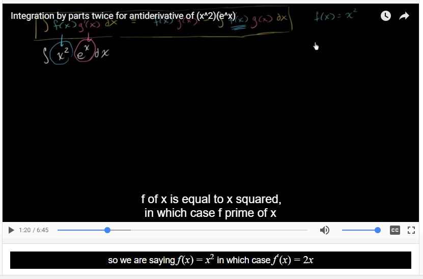

# RichCaptions 

_Symbolic math/science captions for educational videos_

**Live project**: http://apps.pramodk.net:8001/

## Problem identified:

- Online education solutions are rapidly gaining popularity and institutional adoption
- Existing video captioning systems are limited to displaying simple plain-text messages
- Math/science students learn better by reading semantically-useful symbols as found in text books

## Solution created:

- Created web application where content creators can easily caption their videos in LaTeX, the most popular tool for typesetting math and science textbooks and academic papers
- Allows anyone on the internet to watch these captioned videos without cost

## Screenshot

Below, you can compare the status-quo (plain-text) captions to the richer ones provided by this service:

## Design paradigms:

- REST API design and documentation
- Material Design

## Technologies used:

- AngularJS + Javascript/jQuery
- Django + REST framework
- Docker + Docker Compose
- YouTube API
- LaTeX, KaTeX
- TravisCI

---
Pramod Kotipalli http://pramodk.net/
